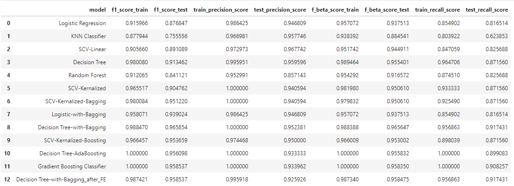

# Anomoly Detection On Google Cloud Platform
> The project aims to correctly detect the anomoly in the 6.7 million rows of data. The project was done as part of Data Science Competition organized at The University of Texas at Dallas.

The entire summary of the project can be found in the [Jupyter Notebook](https://github.com/siddharthoza/Anomoly-Detection-Machine-Learning/blob/master/Imbalanced_Classification.ipynb)

## Table of contents
* [General info](#general-info)
* [Technologies](#technologies)
* [Setup](#setup)
* [Process](#process)
* [Code Examples](#code-examples)
* [Model Output](#Model-Output)
* [Features](#features)
* [Status](#status)
* [Contact](#contact)

## General info
The project will help in Detecting anomoly in a big data with high accuracy. The data is very imbalanced i.e only 364 instance of anomoly among 6.7 million rows of data. 

## Technologies
* Google Cloud Platform (GCP)
* JQuerry on GCP
* Buckets on GCP
* Python - version 3.5

## Setup

1. Create an instance on GCP 
2. Push the entire data in a bucket on GCP before using the python notebook
The dataset used and its metadata can be found [here](https://github.com/siddharthoza/Anomoly-Detection-Machine-Learning/tree/master/datasetparquet). The jupyter notebook can be downloaded [here](https://github.com/siddharthoza/Anomoly-Detection-Machine-Learning/blob/master/Imbalanced_Classification.ipynb) and can be used to reproduce the result.


## Process

* As the data is distributed in 7 files which are in .parquet format, I first created a bucket in google cloud storage and created a table concating all the files.
* The data table is very big in size (25.2gb) hence when I trying to capture it in a dataframe using BigQuery, the system was having a tough time load it.Hence I used sampled data.
* As the dataset is very imbanced (i.e only 364 records out of 6.7 million were labelled as 1), I created a dataframe which comprised of all records labelled as 1 (i.e 364) and 1000 records labelled as 0.
* I will be fitting my models on a smaller dataset and then will use those to predict values in larger dataset and calculate f1_score
* I have used min max scalling as there were few columns which have very large values and that would have effected the model and would have created biasness

**The entire summary of the project can be found in the [Jupyter Notebook](https://github.com/siddharthoza/Anomoly-Detection-Machine-Learning/blob/master/Imbalanced_Classification.ipynb)**


## Code Examples

````
# Extract data from the buckets using JQuerry

query="""
SELECT
* FROM Lucid_0305.table1 where label=1 limit 10000
"""

import google.datalab.bigquery as bq
df = bq.Query(query).execute().result().to_dataframe()
df.head()
````

````
# Support Vector Classifier

from sklearn.svm import SVC
param_grid = {'C': [0.001, 0.01, 0.1, 0.5, 1, 10, 50, 100, 1000], 'max_iter':[1000,10000] }
grid_search = GridSearchCV(SVC(random_state=0,kernel='linear'), param_grid, cv=5, return_train_score=True)
grid_search.fit(X_train, y_train)
lsvc_clf = SVC(C=0.5, max_iter=1000,kernel='linear',random_state=0)
lsvc_clf.fit(X_train,y_train)
y_lsvc_clf = lsvc_clf.predict(X_test)

f1_score_train=f1_score(y_train, lsvc_clf.predict(X_train))
f1_score_test=f1_score(y_test, lsvc_clf.predict(X_test))
````

````
# Random Forest

from sklearn.ensemble import RandomForestClassifier
from sklearn.model_selection import RandomizedSearchCV
from scipy.stats import randint as sp_randint

#Tuning ridge on new dataset
param_grid = {"max_depth": [3, 5, 6,8],
              "max_features": sp_randint(1, 40),
              "min_samples_split": sp_randint(2, 30),
              "min_samples_leaf": sp_randint(1, 20),
              "bootstrap": [True, False]}
random_search = RandomizedSearchCV(RandomForestClassifier(n_estimators=1000), param_distributions=param_grid,
                                   n_iter=20, random_state=0,n_jobs=-1, return_train_score=True)
random_search.fit(X_train, y_train)
````

````
# Gradient Boosting Classifer

from sklearn.ensemble import GradientBoostingClassifier
model = GradientBoostingClassifier(random_state=10, n_estimators= 500)
param_grid = {'max_features':['auto', 'log2'], 'learning_rate' : [0.01,0.1], 'max_depth':[5,10,15,30,50]}
grid_search = GridSearchCV(model, param_grid, cv=5)
grid_search.fit(X_train, y_train)

f1_score_train=f1_score(y_train, grid_search.predict(X_train), average = 'micro')
f1_score_test=f1_score(y_test, grid_search.predict(X_test), average = 'micro')
````


## Model Output


## Features
* With the help of different types of bagging and boosting methods I was able to achieve an accuracy of 99.99%.

## Status
Project is:  _finished_

## Contact

Created by me

If you loved what you read here and feel like we can collaborate to produce some exciting stuff, or if you
just want to shoot a question, please feel free to connect with me on <a href="siddharth.oza@outlook.com" target="_blank">email</a>, 
<a href="https://www.linkedin.com/in/siddharthoza" target="_blank">LinkedIn</a>

My other projects can be found [here](https://siddharthoza.com).
